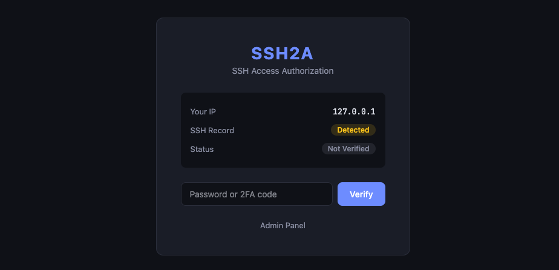

# SSH2A

[English](./README_EN.md) | 简体中文

SSH2A 是一个 SSH 访问认证网关，为 SSH 端口提供 Web 鉴权和蜜罐防护。

## 截图

| 登录页 | 管理台 |
|:---:|:---:|
|  | *待补充* |

## 工作原理

```
客户端 --SSH--> [9022] SSH2A --判断IP状态-->
  ├─ 已验证  → 转发到本机 22 端口（正常 SSH 登录）
  ├─ 首次拒绝 → 记录 IP，关闭连接
  └─ 超时重试 → 进入蜜罐（记录用户名/密码后断开）

客户端 --HTTP--> [9080] SSH2A Web UI
  └─ 输入密码 / 2FA → 验证通过 → SSH 放行
```

## 功能

- **Web 鉴权** — 客户端通过浏览器输入密码或 2FA 验证码，通过后 SSH 端口放行该 IP
- **API 鉴权** — 支持 `Authorization` 请求头直接验证
- **SSH 蜜罐** — 未验证 IP 在超时窗口内重复连接 SSH 将进入蜜罐，记录登录凭据
- **管理台** — Web 管理面板查看蜜罐捕获的凭据、被拒绝 IP、已验证 IP 等统计数据
- **IP 白名单** — 管理台接口支持 IP 访问限制
- **日间/夜间模式** — 前端支持主题切换
- **PostgreSQL 持久化** — 所有记录存储到数据库
- **单二进制部署** — 前端通过 `embed` 打包进 Go 二进制

## 快速开始

### 前置要求

- Go 1.22+
- Node.js 18+ & pnpm
- PostgreSQL

### 从源码构建

```bash
git clone https://github.com/IUnlimit/ssh2a.git
cd ssh2a

# 构建前端 + 编译
make all
```

产物在 `output/` 目录下。

### Docker Compose 部署

```bash
# 编译二进制（Linux amd64）
make linux

# 启动服务
docker compose up -d
```

首次启动会自动生成 `config.yml`，按需修改后重启即可。

### 直接运行

```bash
./output/ssh2a_linux
```

首次运行会在当前目录生成 `config.yml`。

## 配置

```yaml
bind:
  host: 0.0.0.0
  http-port: 9080        # Web UI 端口
  ssh-port: 9022         # SSH 代理端口

authorization:
  type: 'basic'          # basic | authenticator
  basic:
    secret: '123456'
  authenticator:
    private-secret: ''   # 2FA 私钥

database:
  host: 127.0.0.1
  port: 5432
  user: postgres
  password: '123456'
  dbname: ssh2a

honeypot:
  trigger-timeout: 3m    # 拒绝后多久未验证触发蜜罐

auth:
  valid-duration: 30m    # 验证通过后放行持续时间

admin:
  allowed-hosts:         # 管理台 IP 白名单，为空不限制
    - 127.0.0.1
    - ::1
```

## API

| 方法 | 路径 | 说明 |
|------|------|------|
| POST | `/api/v1/auth` | 认证（JSON body 或 Authorization 头） |
| GET | `/api/v1/status` | 查询当前 IP 状态 |
| GET | `/api/v1/admin/stats` | 总览统计 |
| GET | `/api/v1/admin/honeypot` | 蜜罐凭据列表 |
| GET | `/api/v1/admin/rejected` | 被拒绝 IP 列表 |
| GET | `/api/v1/admin/verified` | 已验证 IP 列表 |

## 许可证

[AGPL-3.0](./LICENSE)
